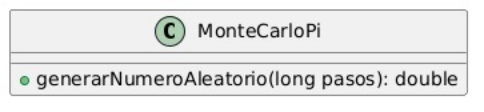
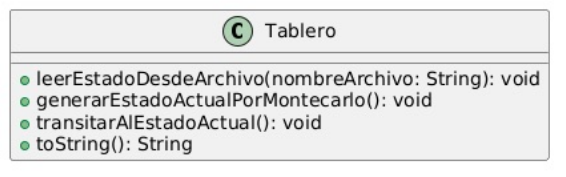
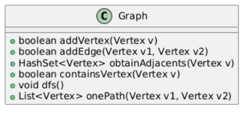

# 1-ExEvContinua

# Diagrama de Clases/Objetos

Este diagrama modela los objetos y métodos necesarios para calcular una aproximación del número π utilizando el método de Montecarlo.

El diagrama modela los objetos y métodos necesarios para realizar el juego de la vida con una interfaz gráfica.

Este tercer diagrama modela los objetos y métodos necesarios para la busqueda de un camino entre dos vértices de un grafo.

Requisitos Previos:

- Java 17 o superior.

- Entero de desarrollo IntelliJ IDEA o Eclipse.

- Tener GIT instalado para poder clonar mi repositorio

Ejecutar el Proyecto:

- Clonar el repositorio (Terminal):
  "git clone "https://github.com/YoelUb/1-PruebaEvaluacionContinua"

- Abrir el proyecto en tu IDE favorito.

- Compilar y ejecutar el main.